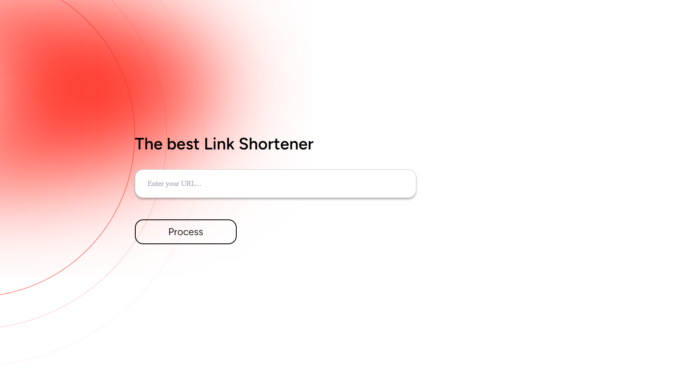
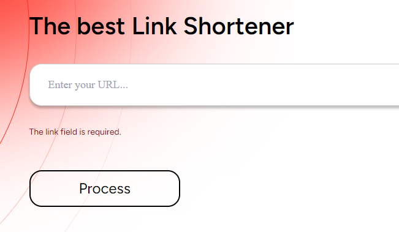
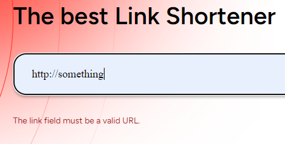
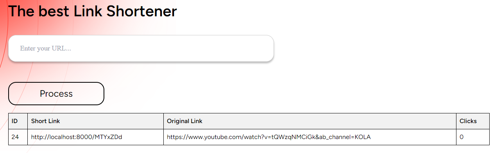
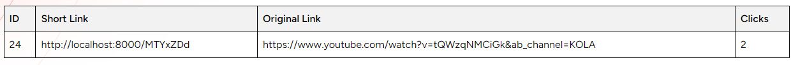

# LinkShortener

### Setup instructions
1. Firstly, you should clone this repository.
```angular2html
git clone https://github.com/TarSan7/LinkShortener.git
cd app
```
2. Copy the example environment configuration file to create your own environment variables:
```angular2html
cp .env.example .env
```
3. Edit the .env file to match Docker setup. Ensure the database credentials match those defined in
the docker-compose.yml (DB_CONNECTION=mysql DB_HOST=db).

4. Use Docker Compose to build and run the containers specified in the docker-compose.yml file:
```angular2html
docker-compose up --build
```
5. After the containers are running, you need to generate a unique application key with the artisan command:
```angular2html
docker exec link-app php artisan key:generate
```
6. Run the database migrations and seeders to set up your database:
```angular2html
docker exec link-app php artisan migrate
```
The Laravel application should be accessible via http://localhost:8000.

To stop and remove all containers, use the following command:
```angular2html
docker-compose down
```
### Troubleshooting
If you encounter permissions issues, make sure Docker has the permissions to access the folders on your machine.
Check the container logs using docker-compose logs for error details.

# Gide in usage
When the main page of the project opens, on the screen appears a form for entering a link and, if there are already shortened links 
in the database, a table with a list of all links and information about clicks on each link.

If your link is an invalid URL or you don't enter anything, an error message will appear.


When you enter a valid url, it is processed and appears on the main page in a table.


There is also a click tracker that counts the number of clicks on this link.

